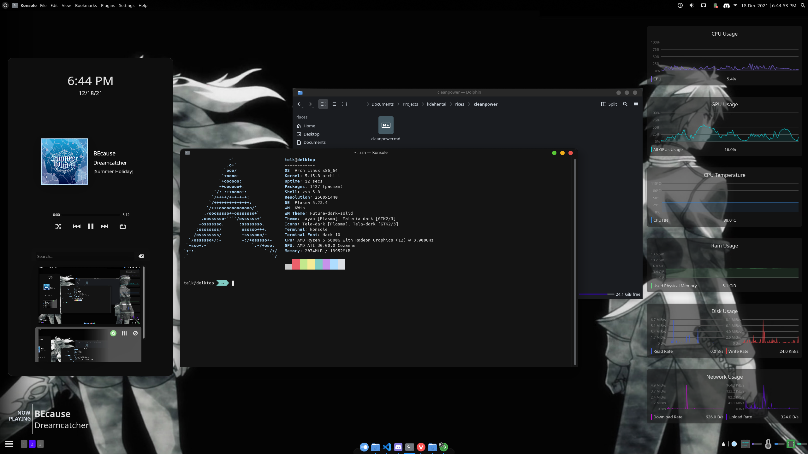

# Simple theme
Has many of the widgets used in default theme but spread accross to fill space and make the top bar more clean.

## Themes
- Global theme: Layan 
- Application style: Lightly
- Plasma style: Orchis dark
- GTK style: Materia dark
- Colors: ArchSmooth
- Window decoration: Future-dark solid (Customized to be solid. Original future dark was translucent and can be found https://store.kde.org/p/1496170/)
- Fonts: Noto
- Icons: Tela Dark
- Cursor: Breeze
- Splash screen: Amandark

Theme files can be found in default

## Top panel (Size 32)
- Application launcher
- Window title
- Global menu
- < Spacer >
- Notification
- Volume
- Network
- Battery
- System tray (Everything hidden/disabled)
- Better inline clock
- Application dashboard

## Latte dock (Size 32px)
### Center
- System Settings
- File manager
- VS Code
- Discord
- Terminal
- Browser

### Left
- Latte Sidebar button (keybind is meta+`)
- Virtual Desktop bar (https://github.com/wsdfhjxc/virtual-desktop-bar)

### Right
- Color picker
- CPU Icon
- System Monitor (Horizontal bar, CPU Total usage)
- Temperature Icon
- System Monitor (Horizontal bar, CPUTIN/CPU temperature)
- Ram Icon
- System Monitor (Horizontal bar, Ram usage)

### Sidebar
- Date and time
- Media player
- Clipboard history

## My thoughts on this theme
Probs will use this for quite a while and see how it goes. I think this is much more cleaner compared to my default theme. One downside is latte dock sometimes uses a lot of memory (not sure why) around 700 MB at one point. It probably is one of the widgets having a memory leak.