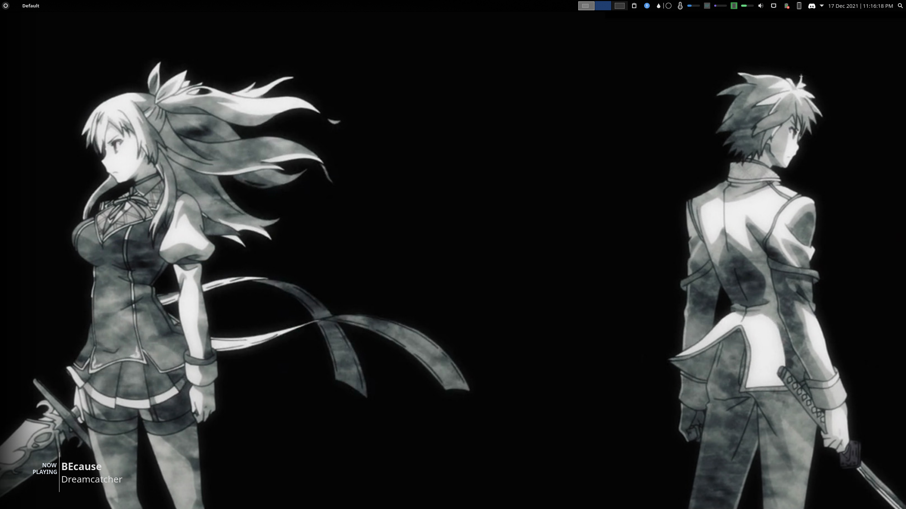
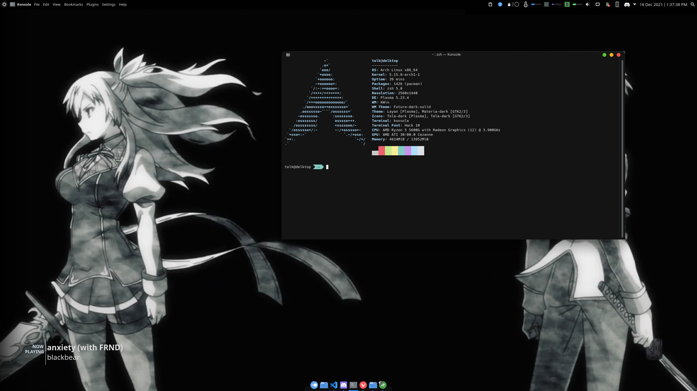

# Default theme
This is the theme that I have used for the most part

## Themes
- Global theme: Layan 
- Application style: Lightly
- Plasma style: Orchis dark
- GTK style: Materia dark
- Colors: ArchSmooth
- Window decoration: Future-dark solid (Customized to be solid. Original future dark was translucent and can be found https://store.kde.org/p/1496170/)
- Fonts: Noto
- Icons: Tela Dark
- Cursor: Breeze
- Splash screen: Amandark

## Top panel (Size 32)
- Application launcher
- Window title
- Global menu
- < Spacer >
- Pager (3 virtual desktops)
- Clipboard
- Notification
- Color picker
- Temperature 
- CPU 
- RAM
- Volume
- Network
- Battery
- KDE Connect
- System tray
- Better inline clock
- Application dashboard

Temperature, CPU, and RAM are all shit af custom widgets... I need to learn more QML as currently they are 2 seperate widgets one being the icon and the other being for text. I have uploaded the icon widget and not the other cuz it is just text. If I figure out how to write proper QML and make better widgets, I will upload this.

## Latte dock (Size 10%)
- System Settings
- File manager
- VS Code
- Discord
- Terminal
- Browser

## My thoughts on this theme
Honestly while I use this daily, I feel that it is quite bulky with too many things on the top panel. It isn't as bad with larger monitors (24 or 27 inches) as the spacer takes a lot of space inbetween. That doesn't mean that I do not hate how cluttered it looks. I think some of them can be hidden in a sidebar that can be opened with a keybind, but my workflow requires all these widgets at close reach. One possible solution would be to use keybinds and not use my mouse as much, but that is something for me to adapt to and that is pain. 

Another thing is that I find it very clean and modern albeit having everything opaque rather than slightly translucent. I don't really like translucency as some apps are very bright (like some webpages), and it blinds the translucent apps. I don't think any future 

After a bit of testing, removing the pager widget on the top panel cleans up the look by a lot.
