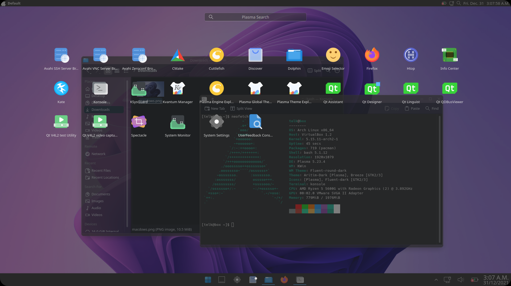

# Macdows
macOS Monterey and Windows 11 merged together to create an abomination 

## Themes
- Global theme: Fluent round dark (https://store.kde.org/p/1544466)
- Application style: Lightly (https://github.com/Luwx/Lightly)
- Plasma style: Fluent round dark 
- GTK style: Breeze (comes by default)
- Colors: Artim Dark (comes from https://store.kde.org/p/1283010)
- Window decoration: Fluent round dark
- Fonts: Noto
- Icons: Fluent dark
- Cursor: Fluent dark

## Top panel (Size 24)
- Kpple Menu (https://store.kde.org/p/1384156/)
- Window title (https://store.kde.org/p/1274218/)
- Global menu
- < Spacer >
- Battery
- Network
- Launchpad
- Digital clock

## Bottom panel (Size 48)
- < Spacer >
- Menu 11
- Show Desktop
- Icons only Task Manager
- < Spacer >
- System tray
- Network
- Audio volume
- Battery
- Digital clock

## My thoughts on this theme
Its cursed and I do not like it, but I wanted to make it as it seemed fun